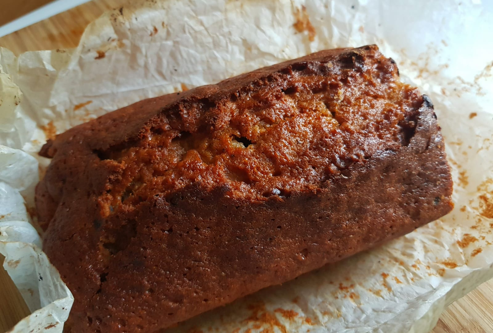

### Best served warm or toasted

- 125g margarine (or butter)
- 125g sugar (half white, half brown)
- 2 small eggs, beaten
- 125g flour (farine bise)
- 1 tsp baking powder
- 2 ripe bananas
- Handful walnuts
- Handful dark chocolate chunks

1. Heat the oven to 190C.

2. Line the loaf tin (25cm) with greaseproof paper and lightly butter it.

3. Melt butter/marg in a metal bowl over hot water.

4. Add the sugar, mixing well.

5. Slowly add 2 beaten eggs with half the flour.

4. Add the remaining flour, baking powder and 2 mashed bananas.

6. Cook until a test skewer comes out clean, about 45 minutes.

7. Leave to cool on a wire rack for 10 minutes.

> *Notes:* \
Modified from BBC goodfood's [Brilliant Banana Loaf](https://www.bbcgoodfood.com/recipes/brilliant-banana-loaf)\
I added chocolate & walnuts.\
Use a thick—based metal saucepan, not a non—stick pan.\
Next time, stick banana chips in the top about 10 mins before it is done.
