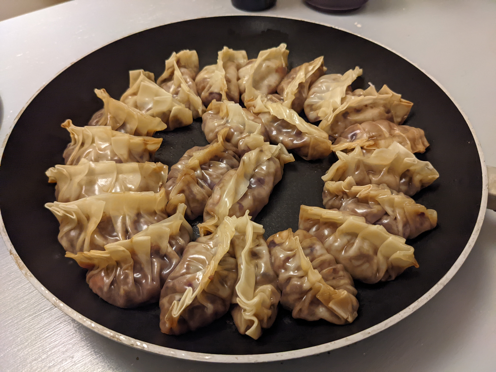

### Makes ~24 dumplings

- 1/2 onion
- 3 garlic cloves
- 2 cm ginger
- 1 carrot
- 8 mushrooms
- 2 leeks
- 1/4 Chinese cabbage
- 1 tbsp miso
- 1 tbsp soy sauce
- 1 tbsp mirin
- Gyoza wrappers

1. Finely chop all the vegetables.

2. Fry the onions, ginger and garlic.

3. Add the other vegetables and sauces and sautée with the sauces.

4. Place a teaspoon of the vegetable mix into the wrapper, line the sides with a wet finger and then fold into beautiful dumplings!

5. Place in a lightly oiled frying pan and fry for a few minutes. Add half a cup of boiling water, cover with a lid and steam until the water is gone.

> *Notes:* \
Video for Gyoza folding: [Youtube](https://www.youtube.com/watch?v=9uzGezdkuso)
