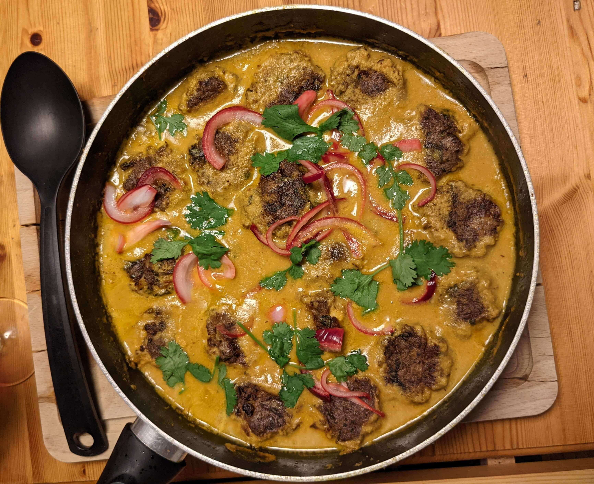

### Makes main for 4 people.
- ½ red onion, _thinly sliced_
- 2 tbsp lemon juice
- 40g cashews
- 20g blanched almonds
- 6 cardamon pods
- 2 tsp cumin seeds
- 2 tsp coriander seeds
- 3 tbsp olive oil
- 1 onion, _roughly chopped_
- 4 garlic cloves, _crushed_
- 2cm fresh ginger
- 1 green chilli
- 1 cinnamon stick
- 1 tsp ground turmeric
- 2 plum tomatoes
- 2 tbsp coriander leaves

### Tofu Meatballs
- 2 tbsp olive oil
- 250g chestnut mushrooms, _sliced_
- 200g firm tofu, _crumbled_
- 3 garlic cloves, _crushed_
- 150g silken Tofu
- 2 tbsp tahini
- 1 tbsp soy sauce
- 30g breadcrumbs
- ½ tbsp cornflour
- 5 spring onions
- 10g coriander, _finely chopped_

1. Fry the courgette in light olive oil on both sides until brown.
   Set aside.

2. Boil the pasta until _al dente_, adding the frozen edamame beans 1 minute before draining.\
    Drain and run under cold water, then leave to dry.

3. Finely chop the basil and parsley. Add salt, pepper, lemon zest.
4. Chop the Scamorza (or Mozzarella) into small pieces.

5. Mix everything together with good olive oil.

> *Notes:* \
Taken from Ottolenghi's Flavour
