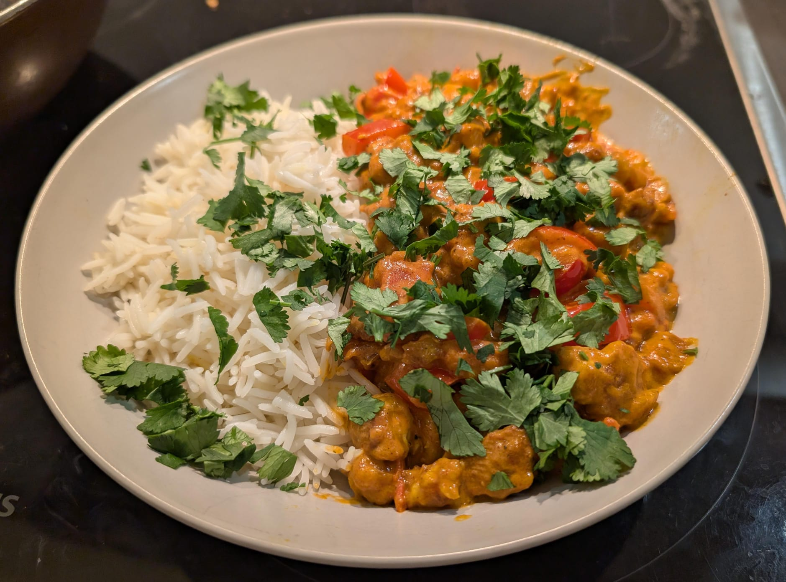
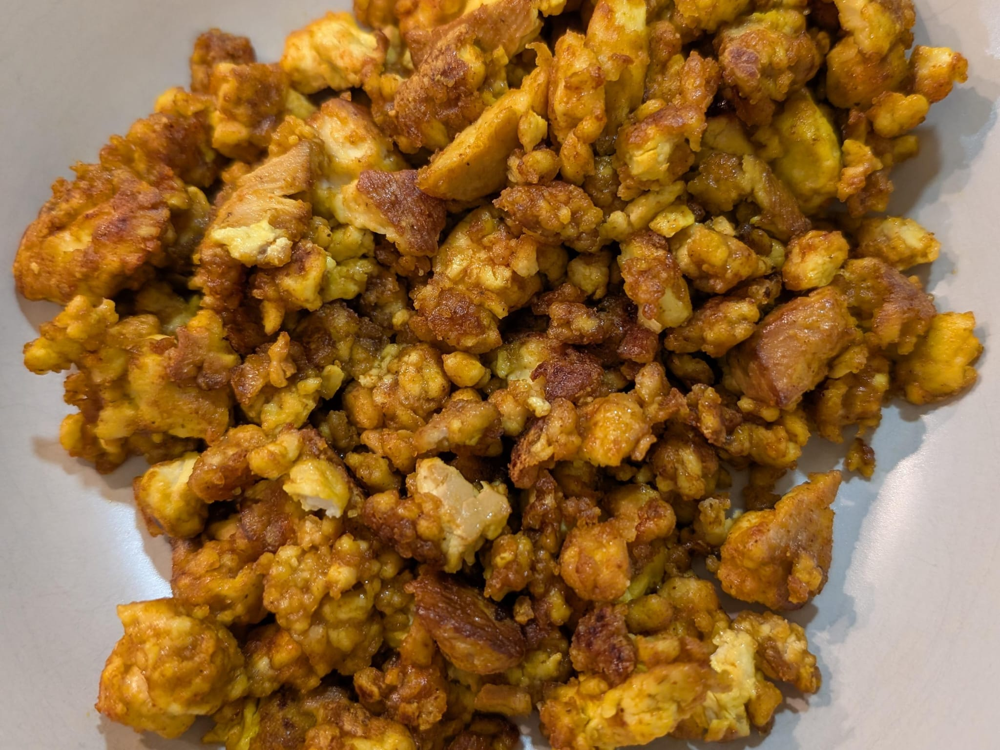

### Makes 2-3 portions

- 1½ onions
- 2 garlic cloves
- 3 cm ginger
- 1 red pepper
- 1 block of smoked tofu
- 1 tbsp cornflower
- 1 tsp smoked paprika
- 1 tsp garam masala
- 1 tsp cumin
- 1 tsp coriander
- 1 tsp tumeric
- 12 cherry tomatoes
- 1 tbsp tomato puree concentrate
- 1 can coconut milk
- 1 pinch MSG
- Basmati rice (½ cup per person)
- Chopped fresh coriander

1. Finely chop all the vegetables.

1. Break the tofu by hand into small chunks. Dry this using kitchen roll or a tea towel.

2. In a wok heat the olive oil, then add the tofu. Mix in smoked paprika and cornflower. Fry until crispy then put aside.

4. Fry the onions, ginger and garlic, along with the spices. Cook for around 5 minutes.

3. Add the red peppers and sautée for 5 minutes.

4. Add the chopped cherry tomatoes and tomato puree and cook for another 5 minutes.

5. Stir in the coconut milk slowly until the sauce reaches the right thickness. I used around 3/4 of a can.

6. Add the crispy tofu and salt & pepper to taste. Don't forget a bit of MSG!

7. Serve with basmati rice and chopped fresh coriander 😊

> *Notes:* \
For the rice, allow 0.5 cups dried basmati rice per person.
Wash the rice well, and place in a pan with 1.5x volume cold water
Leave on a low heat with the lid on until the water is evaporated.