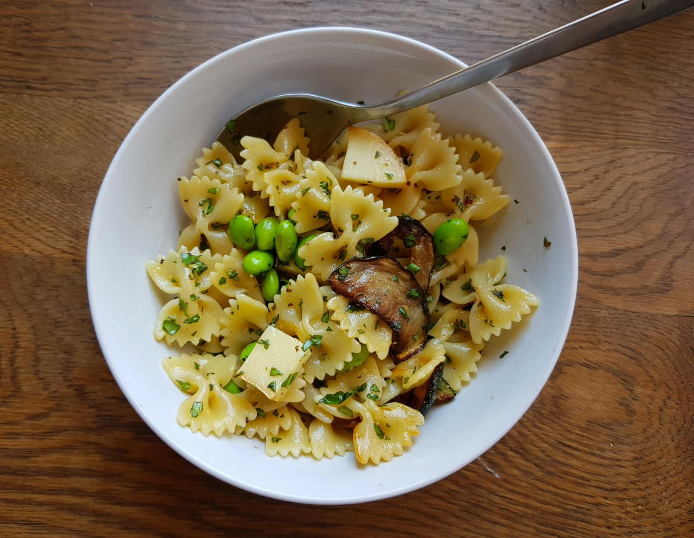

### Makes 2 portions.
- Farfalle pasta, 220g
- 1 courgette
- 50g Scamorza affumicata
- Handful fresh basil leaves
- Half-handful fresh Parsley
- Handful frozen edamame beans
- Lemon zest

1. Fry the courgette in light olive oil on both sides until brown.
   Set aside.

2. Boil the pasta until _al dente_, adding the frozen edamame beans 1 minute before draining.\
    Drain and run under cold water, then leave to dry.

3. Finely chop the basil and parsley. Add salt, pepper, lemon zest.
4. Chop the Scamorza (or Mozzarella) into small pieces.

5. Mix everything together with good olive oil.

> *Notes:* \
Taken from Ottolenghi's Plenty - Pasta with fried courgette.\
Should try with mozzarella, and red wine vinegar for the courgette.
