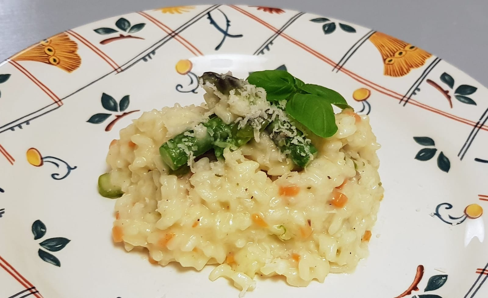

### Makes 2 portions.
- 1/4 onion
- 1/3 carrot
- 1 glass wine
- 8 handfuls rice
- 1 litre veg stock
- 1 knob butter
- Parmesan (lots)

1. Finely chop onion and carrot (no garlic!).\
   Heat oil in pan and cook until soft.

2. Add rice and cook until seethrough-ish.

3. Add wine, cook until it's all absorbed.

4. Add stock 1 spoon at a tine, _constantly_ stirring.
5. Add veg (mushrooms, asparagus etc.) at some point.

6. When it's the right consistancy, take off the heat.
   Add butter & parmesan, stir in.

> *Notes:* \
Use a thick—based metal saucepan, not a non—stick pan.\
Keep the stock on the hob so it stays hot!
